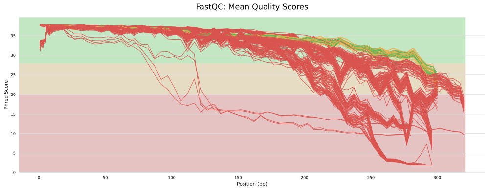

# (PART) READ QC {-}

# Check Raw Reads Statistics
- Assuming that most QC tools are ready, it is time to use them to do the following:
  - Check the quality of the reads using `fastqc`.
  - Create a summary report of quality metrics using `multiqc`.
  - Trim poor read at a user-specified cutoff using `bbduk.sh`.
  - Remove contaminants `bbduk.sh`.

## Statistics of raw reads
```bash
#!/bin/bash

echo PROGRESS: Getting stats of the raw reads.

INPUTDIR="resources/reads"
SEQKIT="results/qc/seqkit1"

mkdir -p "${SEQKIT}"
seqkit stat "${INPUTDIR}"/*.fastq.gz >"${SEQKIT}"/seqkit_stats.txt

```


## FastQC - MultiQC on raw reads
```bash

#!/bin/bash

echo PROGRESS: FastQC - Getting quality scores of raw reads.

INPUTDIR="resources/reads"
FASTQC="results/qc/fastqc1"
mkdir -p "${FASTQC}"
fastqc "${INPUTDIR}"/*.fastq.gz -o "${FASTQC}"

```

```bash
#!/bin/bash

echo PROGRESS: MultiQC - Getting summary of raw read quality scores.

FASTQC="results/qc/fastqc1"
MULTIQC="results/qc/multiqc1"
mkdir -p "${MULTIQC}"
multiqc --force --data-dir "${FASTQC}" -o "${MULTIQC}" --export

```





# Trim Poor Reads

## BBDuk trimming poor reads
```bash
#!/bin/bash

echo PROGRESS: Read trimming
cd resources/reads

for i in `ls -1 *_1.fastq.gz | sed 's/_1.fastq.gz//'`
  do
  bbduk.sh -Xmx3g \
    in1=$i\_1.fastq.gz \
    in2=$i\_2.fastq.gz \
    out1=trimmed/$i\_1.fastq.gz \
    out2=trimmed/$i\_2.fastq.gz \
    qtrim=r \
    trimq=25 \
    overwrite=True
  done

```

## FastQC - MultiQC on trimmed reads
```bash

#!/bin/bash

echo PROGRESS: FastQC - Getting read quality scores of trimmed reads.

INPUTDIR="resources/reads/trimmed/"
FASTQC="results/qc/fastqc2"
mkdir -p "${FASTQC}"
fastqc "${INPUTDIR}"/*.fastq.gz -o "${FASTQC}"

```


```bash
#!/bin/bash

echo PROGRESS: MultiQC - Getting summary of trimmed read quality scores.

FASTQC="results/qc/fastqc2"
MULTIQC="results/qc/multiqc2"
mkdir -p "${MULTIQC}"
multiqc --force --data-dir "${FASTQC}" -o "${MULTIQC}" --export

```


## Seqkit on trimmed reads
```bash

#!/bin/bash

echo PROGRESS: Getting stats of the trimmed reads.

INPUTDIR="resources/reads/trimmed"
SEQKIT="results/qc/seqkit2"
mkdir -p "${SEQKIT}"
seqkit stat "${INPUTDIR}"/*.fastq.gz >"${SEQKIT}"/seqkit_stats.txt

```

# Remove Contaminated Reads

## BBDuk read decontamination
```bash
#!/bin/bash

echo PROGRESS: Read decontamination
cd resources/reads/trimmed

for i in `ls -1 *_1.fastq.gz | sed 's/_1.fastq.gz//'`
  do
  bbduk.sh -Xmx3g \
    in1=$i\_1.fastq.gz \
    in2=$i\_2.fastq.gz \
    out1=decontam/$i\_1.fastq.gz \
    out2=decontam/$i\_2.fastq.gz \
    outm1=decontam/matchedphix/$i\_1.fastq.gz \
    outm2=decontam/matchedphix/$i\_2.fastq.gz \
    ref=~/bbmap/resources/phix174_ill.ref.fa.gz \
    k=25 \
    hdist=1 \
    overwrite=True
  done

```

## FastQC - MultiQC on decontaminated reads
```bash

#!/bin/bash

echo PROGRESS: FastQC - Getting read quality scores of decontaminated reads.

INPUTDIR="resources/reads/trimmed/decontam"
FASTQC="results/qc/fastqc3"
mkdir -p "${FASTQC}"
fastqc "${INPUTDIR}"/*.fastq.gz -o "${FASTQC}"

```


```
## Warning in readLines(script_path): incomplete final line found on
## 'workflow/scripts/multiqc_decontam.sh'
```

```bash
#!/bin/bash

echo PROGRESS: MultiQC - Getting summary of decontaminated read quality scores.

FASTQC="results/qc/fastqc3"
MULTIQC="results/qc/multiqc3"

mkdir -p "${MULTIQC}"
multiqc --force --data-dir "${FASTQC}" -o "${MULTIQC}" --export

```


## Seqkit on decontaminated reads
```bash
#!/bin/bash

echo PROGRESS: Getting stats of the decontaminated reads.

INPUTDIR="resources/reads/trimmed/decontam"
SEQKIT="results/qc/seqkit3"
mkdir -p "${SEQKIT}"
seqkit stat "${INPUTDIR}"/*.fastq.gz >"${SEQKIT}"/seqkit_stats.txt

```


# View Processed Read Status


```r
source("workflow/scripts/common.R")

library(tidyverse, suppressPackageStartupMessages())
library(ggtext)

stats1 <- read_table("results/qc/seqkit1/seqkit_stats.txt", show_col_types = F) %>% 
  mutate(file = str_replace_all(file, ".*/", "")) %>% 
  mutate(file = str_replace_all(file, ".fastq.gz", "")) %>% 
  select(file, rawreads = num_seqs)

stats2 <- read_table("results/qc/seqkit2/seqkit_stats.txt", show_col_types = F) %>% 
  mutate(file = str_replace_all(file, ".*/", "")) %>% 
  mutate(file = str_replace_all(file, ".fastq.gz", "")) %>% 
  select(file, trimmed = num_seqs)

stats3 <- read_table("results/qc/seqkit3/seqkit_stats.txt", show_col_types = F) %>% 
  mutate(file = str_replace_all(file, ".*/", "")) %>% 
  mutate(file = str_replace_all(file, ".fastq.gz", "")) %>% 
  select(file, decontam = num_seqs) 

stats <- inner_join(stats1, stats2, by = "file") %>% 
  inner_join(., stats3, by = "file") %>%
  pivot_longer(-file, names_to = "variable", values_to = "count") %>%
  mutate(variable = factor(variable, 
         levels = c("rawreads", "trimmed", "decontam"))) 

stats %>% 
  ggplot(aes(x = fct_inorder(file), y = count/1E3, fill = variable)) +  
  theme_cdi() +
  geom_col(position = "dodge") +
  labs(x = "Sample", y = "Number of Reads (X1000)", fill = "Color Code") +
  scale_y_continuous(expand = c(0.02, 0.0))

ggsave(file="figures/samples_hist.png", width=5, height=5)
ggsave(file="figures/samples_hist.svg", width=5, height=5)


stats %>% 
  ggplot(aes(x = fct_inorder(variable), y = count/1E3, fill = variable)) +  
  theme_classic() +
  geom_col(position = "dodge") +
  labs(x = "Processed Read", y = "Number of Reads (X500)", fill = "Color Code") +
  scale_y_continuous(expand = c(0.02, 0.0))

ggsave(file="figures/qc_hist.png", width=5, height=5)
ggsave(file="figures/qc_hist.svg", width=5, height=5)

```


